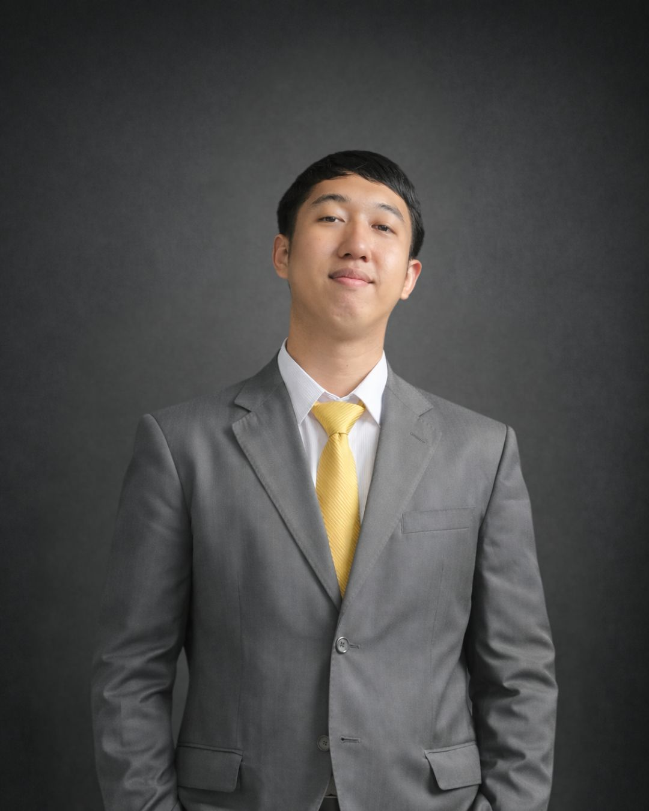

<div align="center">


# Kevin Adisurya Nugraha — Portfolio Website

**Portofolio pribadi Kevin Adisurya Nugraha**, mahasiswa Ilmu Komputer Universitas Pertamina dan Junior Full-Stack Web Developer yang spesialis di Laravel, CodeIgniter, dan teknologi web modern.

[](https://kevindev.vercel.app)
[](https://github.com/kevinadisuryanugraha)
[](https://www.linkedin.com/in/kevin-adisurya-nugraha/)
[](https://www.instagram.com/kvn.ads/)



</div>

---

## 📋 Daftar Isi

- [Tentang Proyek](#-tentang-proyek)
- [Fitur Utama](#-fitur-utama)
- [Teknologi yang Digunakan](#-teknologi-yang-digunakan)
- [Struktur Proyek](#-struktur-proyek)
- [Cara Menjalankan Lokal](#-cara-menjalankan-lokal)
- [Sections](#-sections)
- [Konfigurasi & Kustomisasi](#-konfigurasi--kustomisasi)
- [Deployment](#-deployment)
- [Kontak](#-kontak)

---

## 🎯 Tentang Proyek

Website portofolio ini dibangun sebagai **static single-page application** tanpa framework JavaScript, tanpa build tools, dan tanpa backend — hanya HTML, CSS, dan Vanilla JavaScript murni. Desain mengutamakan performa, estetika modern, dan pengalaman pengguna yang mulus.

### Highlight Teknis
- ⚡ **Zero build step** — langsung buka `index.html` di browser, langsung jalan
- 🎨 **Full Dark Mode** — tema tersimpan di `localStorage`, sinkron antar halaman
- 📱 **Fully Responsive** — dioptimalkan untuk semua ukuran layar
- 🔍 **SEO Ready** — Open Graph, Twitter Card, JSON-LD Schema, Canonical URL
- 🚀 **Performance Optimized** — lazy loading images, resource hints, smooth 60fps animations

---

## ✨ Fitur Utama

### 🌙 Dark Mode / Light Mode
Toggle tema dengan tombol bulan/matahari di navbar. Preferensi tersimpan otomatis di `localStorage` dan berlaku juga di halaman 404.

### 🃏 3D Tilt Effect (Vanilla Tilt.js)
Semua card (portofolio, keahlian, organisasi, sertifikat) memiliki efek 3D parallax tilt + glare saat kursor diarahkan ke atasnya. Dinonaktifkan otomatis di perangkat touch.

### 🔢 Counter Animasi
Stats strip antara section "Tentang" dan "Keahlian" menampilkan angka yang count-up dengan easing `easeOutCubic` saat pertama kali masuk viewport (menggunakan `IntersectionObserver`).

| Stat | Nilai |
|------|-------|
| Proyek Selesai | 7+ |
| Sertifikat | 17+ |
| Teknologi | 10+ |
| Tahun Pengalaman | 1+ |

### 🔽 Portfolio Filter
Filter tombol di atas section Portofolio untuk menyaring proyek berdasarkan teknologi:
- **Semua** — tampilkan semua proyek
- **Laravel** — Management Laundry, POS System
- **PHP Native** — Yayasan CMS
- **HTML/JS** — Pictum, Homie Cozie, Klinik ANF, Panggonan Resto

### ⌨️ Typewriter Effect
Teks di hero section mengetik dan menghapus secara otomatis: `Web Developer`, `AI Antusias`, `Mahasiswa`, `UI/UX Design`.

### 🧭 Smart Navbar
- Background berubah saat scroll (backdrop blur + shadow)
- Active link highlight otomatis mengikuti section yang sedang di-scroll (custom scroll-spy, bukan Bootstrap)
- Collapse otomatis saat link diklik di mobile

### ⬆️ Scroll-to-Top Button
Tombol lingkaran biru muncul di kanan bawah layar setelah scroll 400px ke bawah.

### 📬 Contact Form → WhatsApp
Form kontak langsung membuka WhatsApp dengan pesan terformat, tanpa backend.

### 📄 Custom 404 Page
Halaman `404.html` dengan desain matching: animasi floating 404, dot pattern background, tema sinkron dari main site.

### 🔖 Reveal on Scroll Animation
Elemen dengan class `.reveal` muncul dengan animasi fade+slide saat masuk viewport.

---

## 🛠 Teknologi yang Digunakan

### Core Stack
| Teknologi | Versi | Keterangan |
|-----------|-------|------------|
| HTML5 | — | Semantic markup, ARIA attributes |
| CSS3 | — | Custom properties, Grid, Flexbox, Animations |
| JavaScript | ES2020+ | Vanilla JS, IntersectionObserver, requestAnimationFrame |

### Libraries (CDN)
| Library | Versi | Fungsi |
|---------|-------|--------|
| [Bootstrap](https://getbootstrap.com/) | 5.3.2 | Grid system, modal, collapse |
| [Font Awesome](https://fontawesome.com/) | 6.4.0 | Icon set |
| [Google Fonts — Poppins](https://fonts.google.com/specimen/Poppins) | — | Typography |
| [Vanilla Tilt.js](https://micku7zu.github.io/vanilla-tilt.js/) | 1.8.1 | 3D tilt parallax effect |

### Tools & Services
| Tool | Fungsi |
|------|--------|
| Laragon | Local development server |
| Vercel | Deployment / hosting |
| Git + GitHub | Version control |

---

## 📁 Struktur Proyek

```
kevin-porto/
│
├── index.html              # Entry point — single-page portfolio
├── 404.html                # Custom error page
├── style.css               # All styles (no preprocessor)
├── script.js               # Vanilla JS logic
├── robots.txt              # SEO: crawler rules
├── sitemap.xml             # SEO: sitemap for search engines
├── AGENTS.md               # AI coding agent instructions
│
└── assets/
    ├── favicon.svg         # SVG favicon (blue gradient + K)
    ├── CvAtsKevinAdisurya.pdf   # CV / Resume PDF
    └── image/
        ├── Kevin_Adisurya_Nugraha.jpg   # Hero profile photo
        ├── DSC_1889.JPG                 # About section photo
        ├── portofolio_image/            # Portfolio project screenshots
        │   ├── login.png               # Management Laundry
        │   ├── yayasan_cms.png         # Yayasan CMS
        │   ├── kasir.png               # POS System
        │   ├── pictum.png              # Pictum Coffee
        │   ├── homiecozieCoffee.png    # Homie Cozie Coffee
        │   ├── klinikANF.png           # Klinik ANF
        │   ├── panggonan.webp          # Panggonan Resto
        │   └── tpq-lms.png             # TPQ LMS (upcoming)
        └── sertif_image/               # Certificate images (17+ files)
```

---

## 🚀 Cara Menjalankan Lokal

### Prasyarat
- Web browser modern (Chrome, Firefox, Edge, Safari)
- Local web server (opsional — bisa pakai XAMPP, Laragon, atau VS Code Live Server)

### Tanpa Web Server (cara tercepat)
```bash
# Clone repository
git clone https://github.com/kevinadisuryanugraha/kevindev.vercel.git

# Masuk ke folder
cd kevindev.vercel

# Buka langsung di browser
# Double-click index.html
# atau dari terminal:
start index.html   # Windows
open index.html    # macOS
```

### Dengan Laragon / XAMPP
```bash
# Letakkan folder di:
# Laragon: C:\laragon\www\kevin-porto\
# XAMPP:   C:\xampp\htdocs\kevin-porto\

# Akses via browser:
# http://localhost/kevin-porto/
```

### Dengan VS Code Live Server
1. Install ekstensi **Live Server** di VS Code
2. Klik kanan `index.html` → **"Open with Live Server"**
3. Browser otomatis terbuka di `http://127.0.0.1:5500/`

> **Catatan:** Tidak ada `npm install`, `composer install`, atau build step apapun yang diperlukan.

---

## 📄 Sections

Website terdiri dari **8 section utama** dalam satu halaman:

| # | Section | ID | Deskripsi |
|---|---------|-----|-----------|
| 1 | **Beranda (Hero)** | `#home` | Intro, typewriter effect, CTA buttons, floating tech icons |
| — | **Stats Strip** | — | Counter animasi: proyek, sertifikat, teknologi, pengalaman |
| 2 | **Keahlian** | `#skills` | Backend, Frontend, Tools & Lainnya, Soft Skills (3D tilt cards) |
| 3 | **Tentang** | `#about` | Biodata, foto, contact info cards |
| 4 | **Portofolio** | `#portfolio` | 7 proyek dengan filter (Laravel/PHP/HTML-JS) + 3D tilt |
| 5 | **Pengalaman** | `#experience` | Timeline pendidikan dan pengalaman kerja |
| 6 | **Organisasi** | `#organization` | Kartu organisasi (Karang Taruna, Himpunan Mahasiswa) |
| 7 | **Sertifikat** | `#certificates` | Masonry gallery 17+ sertifikat dengan modal preview |
| 8 | **Kontak** | `#contact` | Form → WhatsApp + social links |

---

## ⚙️ Konfigurasi & Kustomisasi

### Ubah Tema Warna
Edit variabel CSS di `style.css` pada blok `:root`:
```css
:root {
  --primary-color: #2563eb;   /* Warna utama (biru) */
  --primary-dark: #1d4ed8;    /* Warna hover tombol */
  --accent-color: #3b82f6;    /* Warna aksen */
}
```

### Ubah Nomor WhatsApp
Di `script.js`, cari dan ubah:
```js
const waNumber = "6289616682955"; // Ganti dengan nomor WhatsApp kamu
```

### Tambah Proyek Portfolio
Di `index.html`, duplikat salah satu blok `<!-- Project N -->` dan ubah:
- `data-category` → `"laravel"`, `"php"`, atau `"html"`
- `src` gambar, `alt`, judul, deskripsi, tech badges, dan link GitHub/Demo

### Ubah Typewriter Phrases
Di `script.js`:
```js
const phrases = [
  "Web Developer",
  "AI Antusias",
  "Mahasiswa",
  "UI/UX Design",
];
```

### Ganti CV PDF
Replace file `assets/CvAtsKevinAdisurya.pdf` dengan file PDF baru, lalu update `href` di `index.html`:
```html
<a href="assets/NamaFileBaru.pdf" download="CV_Kevin_Adisurya.pdf">
```

### Update Info Kontak
Di `index.html`, cari section `contact-quick-links` dan update:
- Email: `habeelkevin@gmail.com`
- GitHub: `github.com/kevinadisuryanugraha`
- WhatsApp: `+62 896 1668 2955`

---

## 🌐 Deployment

### Vercel (Aktif)
Website ini di-deploy ke **Vercel** sebagai static site. Tidak ada build command yang diperlukan — Vercel langsung serve file HTML, CSS, JS.

**Live URL:** [https://kevindev.vercel.app](https://kevindev.vercel.app)

**Konfigurasi Vercel:**
- Framework Preset: `Other`
- Build Command: *(kosong)*
- Output Directory: `./` (root)

### Deploy ke Platform Lain
Website ini kompatibel dengan semua static hosting:

| Platform | Cara Deploy |
|----------|------------|
| **Netlify** | Drag & drop folder ke [netlify.com/drop](https://app.netlify.com/drop) |
| **GitHub Pages** | Settings → Pages → Branch: `main`, Folder: `/ (root)` |
| **Cloudflare Pages** | Connect repo → Framework: None |
| **Firebase Hosting** | `firebase init hosting` → `firebase deploy` |

---

## 📊 Performa & SEO

### SEO Features
- ✅ Open Graph meta tags (Facebook, WhatsApp preview)
- ✅ Twitter Card meta tags
- ✅ JSON-LD Structured Data (Person schema)
- ✅ Canonical URL
- ✅ `robots.txt` — allow all crawlers
- ✅ `sitemap.xml` — daftarkan semua halaman

### Performance Optimizations
- ✅ `loading="lazy"` pada semua gambar portofolio & sertifikat
- ✅ `rel="preconnect"` untuk semua CDN domain
- ✅ `defer` pada semua script tags
- ✅ `will-change: transform` pada animated elements
- ✅ IntersectionObserver (no scroll event polling)
- ✅ SVG favicon (< 1KB, vector sharp)

---

## 🤝 Kontak

| Platform | Link |
|----------|------|
| 📧 Email | [habeelkevin@gmail.com](mailto:habeelkevin@gmail.com) |
| 💼 LinkedIn | [linkedin.com/in/kevin-adisurya-nugraha](https://www.linkedin.com/in/kevin-adisurya-nugraha/) |
| 🐙 GitHub | [github.com/kevinadisuryanugraha](https://github.com/kevinadisuryanugraha) |
| 📸 Instagram | [@kvn.ads](https://www.instagram.com/kvn.ads/) |
| 💬 WhatsApp | [+62 896 1668 2955](https://wa.me/6289616682955) |

---

<div align="center">

**Dibuat dengan ❤️ oleh Kevin Adisurya Nugraha**

*Universitas Pertamina — Ilmu Komputer*

[](https://kevindev.vercel.app)
[](https://developer.mozilla.org/en-US/docs/Web/HTML)
[](https://developer.mozilla.org/en-US/docs/Web/CSS)
[](https://developer.mozilla.org/en-US/docs/Web/JavaScript)
[](https://getbootstrap.com/)

</div>
